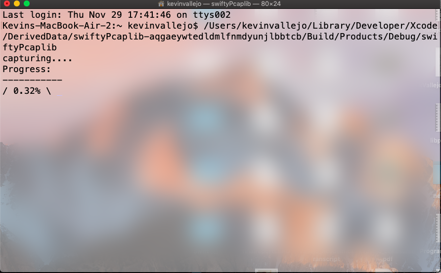
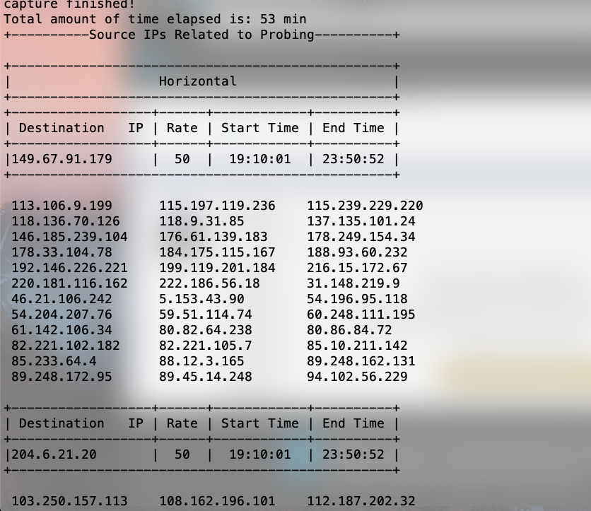

# SwiftDDosDetector
# SwiftPortProbingDetector

Using a darknet data set this algorithm detects different types of port scanning attacks. This is a console app and down below are screenshots on how it would look like when ran....

As file is being analyzed a progress indicator will be present ....

Once scan is complete, if port scans are detected the results are displayed like this: 

