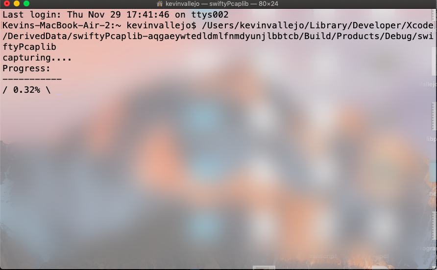

# SwiftDDosDetector
# SwiftPortProbingDetector

Using a darknet dataset this algorithm detects different types of port scanning attacks (Horizontal, Vertical Strobe). This is a console app and down below are screenshots on how it looks like when ran.

As file is being analyzed a progress indicator will be present ....

Once scan is complete, if port scans are detected the results are displayed. Where each attack is seperated by the type of scan and the destination IP that suffered from the attack, below each IP stats are the source IPs responsible for attacking that destination.  

